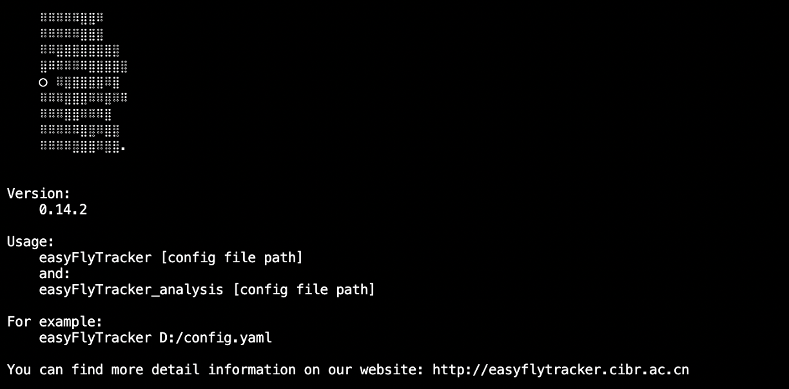

# Install asssistance

## Create pip environment
`python3 -m venv easyfly_env

## Activate the environment
`source easyfly_env/bin/activate`

## Make sure pip is upgrade
`pip install --upgrade pip`

## Install EasyFlyTracker
`pip install -i https://pypi.org/simple/ easyFlyTracker`

## Check whether the install reflect in the environment:
`python -c "import easyFlyTracker"`

## If it does not reflect, restart the environment
`deactivate`

`source easyfly_env/bin/activate`

## Execute program
`easyFlyTracker`

## If you see the figure below on your screen, it works!

